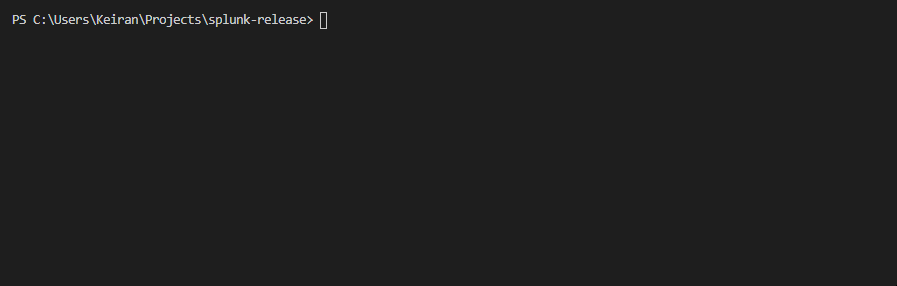

# Splunk Releases

Collection of utilites for interacting with Splunk Enterprise/Universal forwarders releases.

#### Table of Contents
- [Splunk Releases](#splunk-releases)
      - [Table of Contents](#table-of-contents)
  - [Command Line](#command-line)
    - [Usage](#usage)
    - [Environment Variables](#environment-variables)
    - [Example](#example)
  - [Rest API](#rest-api)
    - [Documentation](#documentation)

## Command Line

The command line utility can be used to retrieve the download link to a Splunk release

### Usage
```
Usage: cli [options]

Options:
  -d, --download [filename]  download splunk to [filename]
  -p, --platform <platform>  filter to specified platform i.e. linux
  -a, --arch <arch>          filter to specified architecture i.e x86_64
  -v, --version <version>    filter to specified version i.e 8.1.0.1
  -f, --filetype <filetype>  filter to specified filetype i.e tgz
  -r, --product <product>    filter to specified platform (enterprise/forwarder)
  -h, --help                 display help for command
```

### Environment Variables

Environment variables can also supply filters, cli parameters take precedence over these.

| Environment Variable      | Flag | Example   |
| ------------------------- | ---- | --------- |
| SPLUNKRELEASES_PLATFORM   | -p   | linux     |
| SPLUNKRELEASES_ARCH       | -a   | x86_64    |
| SPLUNKRELEASES_VERSION    | -v   | 8.1.0     |
| SPLUNKRELEASES_FILETYPE   | -f   | tgz       |
| SPLUNKRELEASES_PRODUCT    | -r   | forwarder |
| SPLUNKRELEASES_DOWNLOAD   | -d   | splunk.tgz|

### Example



## Rest API

### Documentation

See the [Postman Collection](#TODO) for documentation and examples for the Rest API

